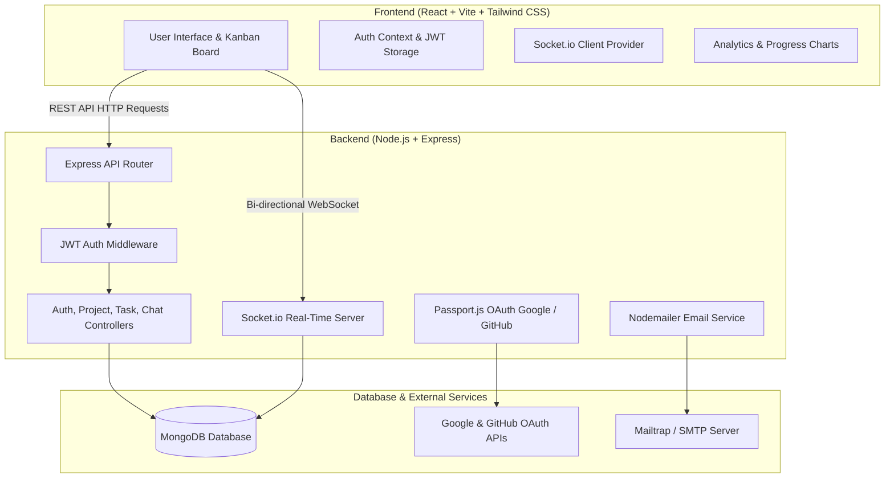

# TaskFlow — Modern Collaborative Project & Task Management Platform

Working Link of this project : https://taskflow-2ube.onrender.com

**TaskFlow** is a modern, full-stack MERN application built for high-velocity team collaboration. It combines an interactive Kanban workflow, real-time group and direct messaging via Socket.io, robust role-based team permissions, productivity analytics, multi-provider OAuth, and background reminder notifications wrapped in a responsive, glassmorphic UI.

---

## Table of Contents

- [Key Features](#key-features)
- [System Architecture](#system-architecture)
- [Tech Stack](#tech-stack)
- [Project Directory Structure](#project-directory-structure)
- [Getting Started](#getting-started)
  - [Prerequisites](#prerequisites)
  - [1. Clone Repository](#1-clone-repository)
  - [2. Backend Configuration & Setup](#2-backend-configuration--setup)
  - [3. Frontend Configuration & Setup](#3-frontend-configuration--setup)
- [Environment Variables](#environment-variables)
  - [Backend (.env)](#backend-env)
  - [Frontend (.env)](#frontend-env)
- [OAuth & Email Integrations](#oauth--email-integrations)
  - [Google OAuth](#google-oauth)
  - [GitHub OAuth](#github-oauth)
  - [Nodemailer / SMTP (Password Reset)](#nodemailer--smtp-password-reset)
- [API Reference](#api-reference)
  - [Authentication Endpoints](#authentication-endpoints)
  - [Project Endpoints](#project-endpoints)
  - [Task Endpoints](#task-endpoints)
  - [Chat Endpoints](#chat-endpoints)
- [Real-Time Socket.io Events](#real-time-socketio-events)
- [Deployment Guide](#deployment-guide)
- [Contributing & License](#contributing--license)

---

## Key Features

### 📋 Interactive Kanban Workflow
- **Drag-and-Drop Organization:** Effortlessly shift tasks between `Todo`, `In Progress`, and `Done` columns with optimistic UI updates.
- **Priority & Due Date Tracking:** Tag tasks with `Low`, `Medium`, or `High` priorities, set target dates, and get automatic visual alerts for overdue items.
- **Dynamic Search & Filtering:** Filter tasks on the fly by search query, status, priority, and sorting orders.

### 💬 Real-Time Team & Direct Messaging (Socket.io)
- **Project Group Chat:** Built-in team room for every project allowing instant discussion of deliverables.
- **Private 1:1 Direct Messages:** End-to-end scoped direct messaging between project members and owners.
- **Secure Room Isolation:** Socket rooms enforce server-side JWT authentication and project membership verification. Non-members cannot intercept or join message rooms.

### 👥 Team Collaboration & Access Control
- **Email Invites:** Invite collaborators to projects by email. If the user hasn't registered yet, invitations automatically link upon account creation.
- **Role-Based Permissions (RBAC):**
  - **Project Owners:** Full project administrative rights (rename project, invite/remove members, delete project).
  - **Project Members:** Create, edit, move, and complete tasks; participate in real-time discussions.

### 📊 Productivity Analytics & Insights
- **7-Day Velocity Chart:** Visual chart (powered by Recharts) plotting tasks completed versus created over the past week.
- **Date Activity Lookup:** Inspect any calendar date to review exact creation and completion milestones.
- **Metric Summaries:** Instant dashboard cards displaying total projects, active tasks, completed counts, and overdue tasks.

### 🔐 Authentication & Security
- **Multiple Auth Methods:** Secure email/password registration with bcrypt password hashing + JWT tokens.
- **Social Logins:** One-click OAuth 2.0 authentication with **Google** and **GitHub**.
- **Forgot Password Flow:** Secure, tokenized password reset links with 30-minute expiration sent via Nodemailer.
- **Security Enhancements:** Live password strength evaluation and visibility toggles.

### ✨ Modern Design & UX
- **Theme Modes:** Dark and Light mode support with automatic persistence in local storage.
- **Skeleton Loaders:** Smooth placeholder loading states across dashboards and Kanban boards.
- **Toast Notifications:** Toast alerts for asynchronous actions (task creation, updates, deletes).
- **Destructive Action Safeguards:** Confirmation modal dialogs before deleting tasks, members, or projects (with confirmation email receipts).
- **PWA Ready & Mobile Friendly:** Installable as a Progressive Web App (PWA) with a dedicated mobile navigation bar.
- **Browser Reminders:** Optional browser notification reminders for tasks due tomorrow.

---

## System Architecture



---

## Tech Stack

### Frontend
- **Framework & Build Tool:** [React 18](https://react.dev/) with [Vite](https://vitejs.dev/)
- **Styling:** [Tailwind CSS](https://tailwindcss.com/) with custom animations and glassmorphism styling
- **Routing:** [React Router DOM v6](https://reactrouter.com/)
- **State Management & Contexts:** React Context API (`AuthContext`, `SocketContext`, `ThemeContext`, `ToastContext`)
- **HTTP Client:** [Axios](https://axios-http.com/) with global interceptors for Bearer token injection
- **Real-Time Client:** [Socket.io Client](https://socket.io/docs/v4/client-api/)
- **Data Visualization:** [Recharts](https://recharts.org/)
- **Icons:** [Lucide React](https://lucide.dev/)

### Backend
- **Runtime:** [Node.js](https://nodejs.org/) (v18+)
- **Framework:** [Express.js](https://expressjs.com/)
- **Database ODM:** [Mongoose](https://mongoosejs.com/) for [MongoDB](https://www.mongodb.com/)
- **Real-Time Engine:** [Socket.io](https://socket.io/) (HTTP server integration + JWT handshake auth)
- **Authentication:** [JSON Web Tokens (jsonwebtoken)](https://jwt.io/), [bcryptjs](https://www.npmjs.com/package/bcryptjs), [Passport.js](http://www.passportjs.org/)
- **OAuth Strategies:** `passport-google-oauth20`, `passport-github2`
- **Email Delivery:** [Nodemailer](https://nodemailer.com/)

---

## Project Directory Structure

```
taskflow/
├── .gitignore
├── README.md
│
├── backend/
│   ├── .env.example
│   ├── .gitignore
│   ├── package.json
│   ├── server.js               # Express app & Socket.io server bootstrap
│   ├── config/
│   │   ├── db.js               # MongoDB connection logic
│   │   └── passport.js         # Google & GitHub OAuth configuration
│   ├── controllers/
│   │   ├── authController.js   # Register, Login, OAuth, Profile, Password Reset
│   │   ├── chatController.js   # Group & Direct message history & persistence
│   │   ├── projectController.js# Project CRUD & team invitation handling
│   │   └── taskController.js   # Task CRUD, filters, statistics & progress
│   ├── middleware/
│   │   ├── auth.js             # JWT verification middleware
│   │   └── errorHandler.js     # Centralized error handler
│   ├── models/
│   │   ├── Message.js          # Chat message schema
│   │   ├── Project.js          # Project & team membership schema
│   │   ├── Task.js             # Kanban task schema
│   │   └── User.js             # User account schema with password methods
│   ├── routes/
│   │   ├── authRoutes.js       # /api/auth/* endpoints
│   │   ├── chatRoutes.js       # /api/projects/:projectId/chat/* endpoints
│   │   ├── projectRoutes.js    # /api/projects/* endpoints
│   │   └── taskRoutes.js       # /api/tasks/* endpoints
│   ├── socket/
│   │   └── chat.js             # Socket.io connection, room join & messaging handlers
│   └── utils/
│       └── sendEmail.js        # Nodemailer transport utility
│
└── frontend/
    ├── .env.example
    ├── .gitignore
    ├── index.html
    ├── package.json
    ├── postcss.config.js
    ├── tailwind.config.js
    ├── vite.config.js
    ├── public/
    │   └── manifest.json       # PWA Manifest specification
    └── src/
        ├── main.jsx            # React root & Context Provider tree
        ├── App.jsx             # Router definition & route protection
        ├── index.css           # Global Tailwind directives & custom CSS variables
        ├── api/
        │   ├── axios.js        # Axios instance configured with JWT interceptors
        │   └── chat.js         # API client functions for chat
        ├── components/
        │   ├── AuroraBackground.jsx   # Ambient gradient background
        │   ├── Avatar.jsx             # User avatar with photo/initials fallback
        │   ├── ConfirmDialog.jsx      # Reusable confirmation modal
        │   ├── ErrorBoundary.jsx      # React error boundary fallback screen
        │   ├── InviteModal.jsx        # Project teammate invite popup
        │   ├── KanbanColumn.jsx       # Kanban lane (Todo, In Progress, Done)
        │   ├── MobileNav.jsx          # Bottom tab navigation bar for phones
        │   ├── Navbar.jsx             # Top branding & profile navigation bar
        │   ├── OAuthButtons.jsx       # Google and GitHub sign-in buttons
        │   ├── PasswordInput.jsx      # Password field with show/hide toggle
        │   ├── PasswordStrengthMeter.jsx # Visual entropy validator
        │   ├── PrivateRoute.jsx       # Route guard for authenticated views
        │   ├── ProgressChart.jsx      # 7-day velocity chart with Recharts
        │   ├── ProjectCard.jsx        # Project overview card
        │   ├── Skeleton.jsx           # Pulsing loading placeholder shapes
        │   ├── StatsCard.jsx          # Metric statistic counter card
        │   ├── TaskCard.jsx           # Draggable Kanban task item
        │   ├── TaskModal.jsx          # Create / Edit task dialog
        │   └── chat/
        │       ├── ChatMemberList.jsx # Channel list & project members
        │       ├── ChatPanel.jsx      # Slide-over chat container
        │       ├── DirectChatView.jsx # 1:1 direct conversation view
        │       └── GroupChatView.jsx  # Project team room conversation view
        ├── context/
        │   ├── AuthContext.jsx        # User state, login, logout & token management
        │   ├── SocketContext.jsx      # Socket.io lifecycle & event hooks
        │   ├── ThemeContext.jsx       # Dark/light mode theme toggling
        │   └── ToastContext.jsx       # Pop-up toast alerts manager
        ├── hooks/
        │   └── useNotificationReminders.js # Browser notification reminders
        └── pages/
            ├── Dashboard.jsx          # Main overview, projects list & metrics
            ├── ForgotPassword.jsx     # Password recovery initiation
            ├── Login.jsx              # User sign in page
            ├── OAuthCallback.jsx      # Token handler for OAuth redirection
            ├── Profile.jsx            # User profile, photo upload & analytics
            ├── ProjectDetails.jsx     # Project Kanban board & Team drawer
            ├── Register.jsx           # User registration page
            └── ResetPassword.jsx      # New password assignment page
```

---

## Getting Started

### Prerequisites
- **Node.js**: `v18.0.0` or later
- **npm** or **yarn**
- **MongoDB**: A running local MongoDB instance (`mongodb://127.0.0.1:27017`) or a free [MongoDB Atlas Cluster](https://www.mongodb.com/cloud/atlas)

---

### 1. Clone Repository

```bash
git clone https://github.com/your-username/taskflow.git
cd taskflow
```

---

### 2. Backend Configuration & Setup

1. Open a terminal and navigate to the `backend` folder:
   ```bash
   cd backend
   ```

2. Install backend dependencies:
   ```bash
   npm install
   ```

3. Create your environment file:
   ```bash
   cp .env.example .env
   ```

4. Edit `backend/.env` with your settings (at minimum `MONGO_URI` and `JWT_SECRET`):
   ```env
   PORT=5000
   MONGO_URI=mongodb://127.0.0.1:27017/taskflow
   JWT_SECRET=your_super_secret_jwt_key_32_characters_long
   SERVER_URL=http://localhost:5000
   CLIENT_URL=http://localhost:5173
   ```

5. Start the backend development server:
   ```bash
   npm run dev
   ```
   *The backend will run on `http://localhost:5000` with nodemon auto-reloading.*

---

### 3. Frontend Configuration & Setup

1. Open a second terminal and navigate to the `frontend` folder:
   ```bash
   cd frontend
   ```

2. Install frontend dependencies:
   ```bash
   npm install
   ```

3. Create your environment file:
   ```bash
   cp .env.example .env
   ```

4. Verify your `frontend/.env` contents:
   ```env
   VITE_API_URL=http://localhost:5000/api
   VITE_SOCKET_URL=http://localhost:5000
   ```

5. Start the Vite development server:
   ```bash
   npm run dev
   ```

6. Open your browser and navigate to **`http://localhost:5173`**.

---

## Environment Variables

### Backend (.env)

| Variable | Required | Default | Description |
|---|---|---|---|
| `PORT` | Optional | `5000` | Port for the Express server to listen on |
| `MONGO_URI` | **Yes** | — | MongoDB connection string (Local or MongoDB Atlas) |
| `JWT_SECRET` | **Yes** | — | Secret key used to sign and verify JSON Web Tokens |
| `SERVER_URL` | **Yes** | `http://localhost:5000` | Public backend URL (used for OAuth callbacks) |
| `CLIENT_URL` | **Yes** | `http://localhost:5173` | Allowed frontend URL (for CORS, reset links, OAuth redirects) |
| `GOOGLE_CLIENT_ID` | Optional | — | Google Cloud OAuth 2.0 Client ID |
| `GOOGLE_CLIENT_SECRET` | Optional | — | Google Cloud OAuth 2.0 Client Secret |
| `GITHUB_CLIENT_ID` | Optional | — | GitHub Developer OAuth App Client ID |
| `GITHUB_CLIENT_SECRET`| Optional | — | GitHub Developer OAuth App Client Secret |
| `SMTP_HOST` | Optional | — | SMTP host address for password reset emails |
| `SMTP_PORT` | Optional | `587` | SMTP port (e.g., 587 or 465) |
| `SMTP_USER` | Optional | — | SMTP username / authentication account |
| `SMTP_PASS` | Optional | — | SMTP password / app access token |
| `EMAIL_FROM` | Optional | `TaskFlow <no-reply@taskflow.app>` | Sender email address for outgoing emails |

### Frontend (.env)

| Variable | Required | Default | Description |
|---|---|---|---|
| `VITE_API_URL` | **Yes** | `http://localhost:5000/api` | Base URL for REST API endpoints |
| `VITE_SOCKET_URL` | Optional | *(derived from API URL)* | Base URL for Socket.io real-time connection |

---

## OAuth & Email Integrations

### Google OAuth
1. Go to the [Google Cloud Console](https://console.cloud.google.com/apis/credentials).
2. Create an **OAuth 2.0 Client ID** (Web application).
3. Set **Authorized JavaScript origins** to `http://localhost:5000` (and `http://localhost:5173`).
4. Set **Authorized redirect URIs** to:
   ```
   http://localhost:5000/api/auth/google/callback
   ```
5. Paste the Client ID and Secret into `backend/.env`.

### GitHub OAuth
1. Go to [GitHub Developer Settings > OAuth Apps](https://github.com/settings/developers).
2. Click **New OAuth App**.
3. Set **Homepage URL** to `http://localhost:5173`.
4. Set **Authorization callback URL** to:
   ```
   http://localhost:5000/api/auth/github/callback
   ```
5. Copy the Client ID and Client Secret into `backend/.env`.

### Nodemailer / SMTP (Password Reset)
- For local testing, create a free sandbox account on [Mailtrap](https://mailtrap.io).
- Fill `SMTP_HOST`, `SMTP_PORT`, `SMTP_USER`, and `SMTP_PASS` in `backend/.env`.
- *Note: If SMTP is not configured, password reset tokens and links are printed directly to the backend terminal console for seamless development testing.*

---

## API Reference

All protected routes require an `Authorization: Bearer <token>` header.

### Authentication Endpoints

| Method | Endpoint | Access | Description |
|---|---|---|---|
| `POST` | `/api/auth/register` | Public | Register new user with username, name, email & password |
| `POST` | `/api/auth/login` | Public | Authenticate user & return JWT token |
| `GET` | `/api/auth/me` | Private | Retrieve currently authenticated user profile |
| `PUT` | `/api/auth/profile` | Private | Update name, username, or profile avatar |
| `POST` | `/api/auth/forgot-password` | Public | Send password reset email with temporary token |
| `PUT` | `/api/auth/reset-password/:token` | Public | Reset password using valid reset token |
| `GET` | `/api/auth/google` | Public | Initiate Google OAuth flow |
| `GET` | `/api/auth/google/callback` | Public | Google OAuth callback handler |
| `GET` | `/api/auth/github` | Public | Initiate GitHub OAuth flow |
| `GET` | `/api/auth/github/callback` | Public | GitHub OAuth callback handler |

### Project Endpoints

| Method | Endpoint | Access | Description |
|---|---|---|---|
| `GET` | `/api/projects` | Private | List all projects owned by or shared with the user |
| `POST` | `/api/projects` | Private | Create a new project |
| `GET` | `/api/projects/:id` | Private | Get details of a single project (accessible members) |
| `PUT` | `/api/projects/:id` | Owner | Update project title or description |
| `DELETE`| `/api/projects/:id` | Owner | Delete project and send email receipt |
| `POST` | `/api/projects/:id/invite` | Owner | Invite a teammate by email |
| `DELETE`| `/api/projects/:id/members/:userId` | Owner | Remove a member from the project |

### Task Endpoints

| Method | Endpoint | Access | Description |
|---|---|---|---|
| `GET` | `/api/tasks` | Private | List tasks with filters (`?project=`, `?status=`, `?priority=`, `?search=`, `?sortBy=`) |
| `POST` | `/api/tasks` | Private | Create a new task within a project |
| `PUT` | `/api/tasks/:id` | Private | Update task status, title, description, priority, or due date |
| `DELETE`| `/api/tasks/:id` | Private | Delete a task |
| `GET` | `/api/tasks/stats` | Private | Get summary statistics (total, completed, overdue, etc.) |
| `GET` | `/api/tasks/progress` | Private | Retrieve 7-day velocity progress data |
| `GET` | `/api/tasks/progress/day` | Private | Get completed and created tasks for a specific date (`?date=YYYY-MM-DD`) |
| `GET` | `/api/tasks/due-tomorrow` | Private | Get tasks due tomorrow for reminder notifications |

### Chat Endpoints

| Method | Endpoint | Access | Description |
|---|---|---|---|
| `GET` | `/api/projects/:projectId/chat/group` | Project Member | Retrieve group message history for a project |
| `POST` | `/api/projects/:projectId/chat/group` | Project Member | Post a group message to the project room |
| `GET` | `/api/projects/:projectId/chat/conversations`| Project Member | List conversations and unread indicators |
| `GET` | `/api/projects/:projectId/chat/direct/:otherUserId` | Project Member | Retrieve 1:1 direct message history with a teammate |
| `POST` | `/api/projects/:projectId/chat/direct/:otherUserId` | Project Member | Send a 1:1 direct message to a teammate |

---

## Real-Time Socket.io Events

Socket.io connections are authenticated via JWT in the handshake query or authorization header.

### Room Architecture
- **Project Room:** `project:<projectId>` — Accessible to verified members and owner of the project.
- **Direct Room:** `dm:<projectId>:<minUserId>:<maxUserId>` — Deterministically generated room restricted exclusively to the two participating user IDs.

### Events

| Direction | Event Name | Payload | Description |
|---|---|---|---|
| Client → Server | `join-project` | `{ projectId }` | Join the project group chat room |
| Client → Server | `join-dm` | `{ projectId, otherUserId }` | Join a private 1:1 chat room |
| Client → Server | `send-message` | `{ projectId, receiverId, text }` | Send a real-time message |
| Server → Client | `new-message` | `MessageObject` | Emitted to room participants on new message |
| Server → Client | `error` | `{ message }` | Emitted when validation or authorization fails |

---

## Deployment Guide

### 1. Database (MongoDB Atlas)
1. Create a free cluster at [MongoDB Atlas](https://www.mongodb.com/cloud/atlas).
2. Create a database user and allow network access from anywhere (`0.0.0.0/0`).
3. Copy your connection string into your backend environment variable `MONGO_URI`.

### 2. Backend (Render / Railway / Fly.io)
1. Deploy the `backend` folder as a Web Service.
2. Build command: `npm install`
3. Start command: `node server.js`
4. Set all required environment variables in the host dashboard:
   - `MONGO_URI`, `JWT_SECRET`, `PORT=5000`
   - `SERVER_URL=https://your-backend.onrender.com`
   - `CLIENT_URL=https://your-frontend.vercel.app`

### 3. Frontend (Vercel / Netlify)
1. Deploy the `frontend` folder as a Single Page Application (SPA).
2. Build command: `npm run build`
3. Output directory: `dist`
4. Configure environment variables in the frontend host:
   - `VITE_API_URL=https://your-backend.onrender.com/api`
   - `VITE_SOCKET_URL=https://your-backend.onrender.com`

---

## Contributing & License

Contributions, issues, and feature requests are welcome!

1. Fork the Project
2. Create your Feature Branch (`git checkout -b feature/AmazingFeature`)
3. Commit your Changes (`git commit -m 'Add some AmazingFeature'`)
4. Push to the Branch (`git push origin feature/AmazingFeature`)
5. Open a Pull Request

This project is licensed under the [MIT License](LICENSE).
